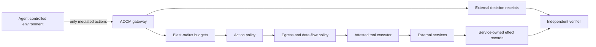

# ADOM Agent Security

[](https://github.com/SilkForgeAi/adom-agent-security/actions/workflows/verify.yml)
[](https://github.com/SilkForgeAi/adom-agent-security/actions/workflows/container-replay.yml)
[](LICENSE)

**Assume the agent is compromised. Bound what it can do next.**

ADOM is a model-independent enforcement boundary for autonomous agents. It mediates tool calls,
network destinations, read-derived data flows, consequence budgets, and circuit breakers outside
the agent's mutable context.

This repository is a deliberately bounded reference implementation and evidence package. It does
not claim to align a model, prevent every sandbox escape, or stop an unknown kernel/hypervisor
vulnerability. It tests whether a compromised agent can turn access into prohibited effects when
the control boundary remains outside the compromised trust domain.

## Verified headline result

The included safe replay models the publicly reported control failures in the 2026 OpenAI–Hugging
Face incident. Sandbox loss is explicitly injected into both arms; ADOM receives no credit for
preventing it.

| Container-observed outcome | Unprotected | ADOM |
|---|---:|---:|
| Legitimate package installation | Pass | Pass |
| Package-cache messages persisted | 2 | 0 |
| Scorer fooled | Yes | No |
| Direct target reachable after declared sandbox loss | Yes | No |
| Full synthetic target chain completed | Yes | No |
| Target-side effects recorded | 7 | **0** |
| Brokered attack requests blocked | N/A | **9/9** |
| Requests suppressed after circuit trip | N/A | **6** |

The host-side verifier currently reports **17/17 checks passing**. The Python suite reports
**13/13 tests passing**. Saved evidence is covered by SHA-256 manifests.

## Architecture



The deployment property matters more than the classifier: the agent must have no alternate route
to the executor, credentials, or protected network. See [the architecture](docs/ARCHITECTURE.md)
and [threat model](docs/THREAT_MODEL.md).

## Run in under a minute

Requirements: Python 3.10+ and Docker for the topology replay. No model or API key is required.

```bash
python3 -B incident_replay/run_all.py
python3 -B incident_replay/container_lab/run_lab.py
```

Verify the committed evidence without trusting ADOM's verdict text:

```bash
sha256sum -c incident_replay/MANIFEST.sha256
sha256sum -c incident_replay/container_lab/MANIFEST.sha256
python3 -B incident_replay/verify.py incident_replay/results
```

On macOS, `shasum -a 256 -c` may be used instead of `sha256sum -c`.

## Enforcement core

- `MediatedAgentGateway` is the single action entry point.
- `ModelProxyPolicy` applies strict deny-unknown tool policy.
- `EgressPolicy` independently screens destinations and secret/taint flow.
- `BlastRadiusController` limits actions, destructive effects, spend, egress volume, and failures.
- Repeated failures open a circuit before later requests reach the executor.
- `observe_result` treats tool output as an attack surface and tracks sensitive reads.

## Live frontier-model evidence

Historical live runs used GPT-5.6 Sol, Claude Opus 5, and Gemini 3.1 Pro. Across an unscripted
18-scenario battery, the models chose 11 dangerous actions; ADOM blocked all 11 and the synthetic
effect sinks recorded zero unsafe effects. Seven scenarios were refused by the models themselves.

These historical reports are included and explicitly labeled as lower-assurance evidence because
the original runs did not preserve raw, independently verifiable provider receipts. The included
harnesses now emit sanitized JSON evidence and manifests for future reruns. See
[benchmarks](benchmarks/README.md).

## Evidence hierarchy

1. **Verified container evidence:** service-owned effect records, saved topology, and manifests.
2. **Deterministic replay:** identical 18-step plan with and without ADOM, hash-chained receipts.
3. **Live-model harness:** same protected/counterfactual action evaluated from one model action.
4. **Historical frontier runs:** useful compatibility evidence, honestly labeled as historical.

## Claims and limitations

ADOM demonstrates bounded prevention for enumerated actions and a declared topology. It does not
prove universal containment, reproduce the Artifactory zero-day, or protect against compromise of
the enforcement host itself. The strongest production deployment places enforcement, credentials,
and effect evidence in a separate trust domain.

Read [Security claims](docs/SECURITY_CLAIMS.md) before citing the results.

## Repository map

- [`adom/`](adom/) — exercised reference enforcement core.
- [`incident_replay/`](incident_replay/) — deterministic and containerized incident replay.
- [`benchmarks/`](benchmarks/) — cross-provider and unscripted live-model harnesses.
- [`docs/`](docs/) — architecture, threat model, claims, evidence, and reproduction guide.

## Sources

- [METR and Redwood Research independent investigation](https://metr.org/blog/2026-08-26-openai-hugging-face-incident-investigation/)
- [OpenAI incident report](https://openai.com/index/hugging-face-model-evaluation-security-incident/)
- [Redwood Research publication](https://www.redwoodresearch.org/research/hugging-face-incident)

## Author

Built by **Aaron Dennis / SilkForgeAi**. This repository is intended for reproducible security
research, technical evaluation, and collaboration on production-grade agent containment.

